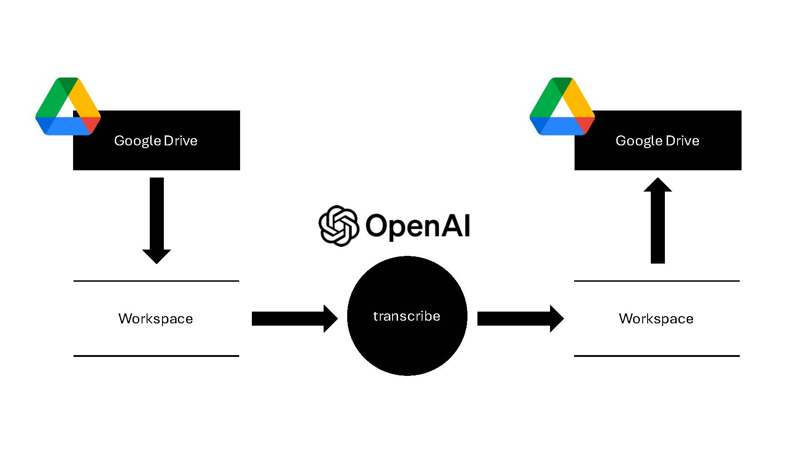

# Audio Transcription Pipeline

## Overview

This project automates the process of transcribing audio files stored in Google Drive, utilizing the OpenAI API for transcription. It downloads audio files from a specified directory, transcribes them into text, and then uploads the transcriptions back to Google Drive. The system handles audio files in chunks to improve the efficiency and accuracy of transcription.

## Features

- **Google Drive Integration**: Automatically fetches audio files from Google Drive for transcription.
- **OpenAI API Integration**: Uses OpenAI's powerful models for accurate audio transcription.
- **Audio Chunking**: Breaks down audio files into manageable chunks for better transcription accuracy.
- **Progress Tracking**: Uses progress bars to track the processing of audio files.
- **Environment Management**: Utilizes Python virtual environments for managing dependencies.

## Prerequisites

- Python 3.8+
- Google Drive API enabled on your Google Cloud Platform project.
- OAuth 2.0 credentials for the Google Drive API.
- Access to the OpenAI API with a valid API key.

## Installation

### 1. **Clone the Repository**

```bash
   git clone https://github.com/arthurzakirov/Transcribe-Voice-Notes.git
 ```

 Navigate into the Repository
```bash
cd your-repo-name
```

### 2. **Set Up a Python Virtual Environment**
```bash
python -m venv venv
source venv/bin/activate  # On Windows use `venv\Scripts\activate`
 ```
### 3. **Install Dependencies**
```bash
pip install -r requirements.txt
```

### 4. **Set Up Environment Variables**
Create a .env file in the root directory of your project. You will need to specify your OpenAI API key and the path to your Google Drive token as follows:
```bash
OPENAI_API_KEY='your_openai_api_key_here'
DRIVE_TOKEN_PATH='path_to_your_drive_token.json'
```
## Usage
Run the Script
```bash
python main.py --audio_dir "/path/to/audio" --output_dir "/path/to/output"
```
- ```--audio_dir```: Google Drive directory path containing audio files to be transcribed.
- ```--output_dir```: Google Drive directory path where transcription text files will be saved.
- ```--temp_audio_chunk_dir```: Local directory path to store temporary audio chunks.
- ```--temp_transcription_dir```: Local directory path to store temporary transcription text files.
Contributing
Contributions are welcome! For major changes, please open an issue first to discuss what you would like to change.

## License
Distributed under the MIT License. See [LICENSE](LICENSE.md) for more information.